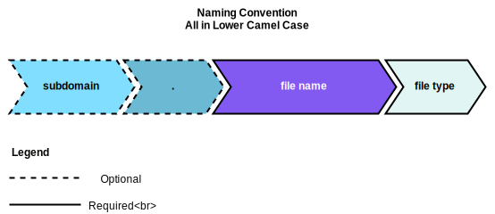
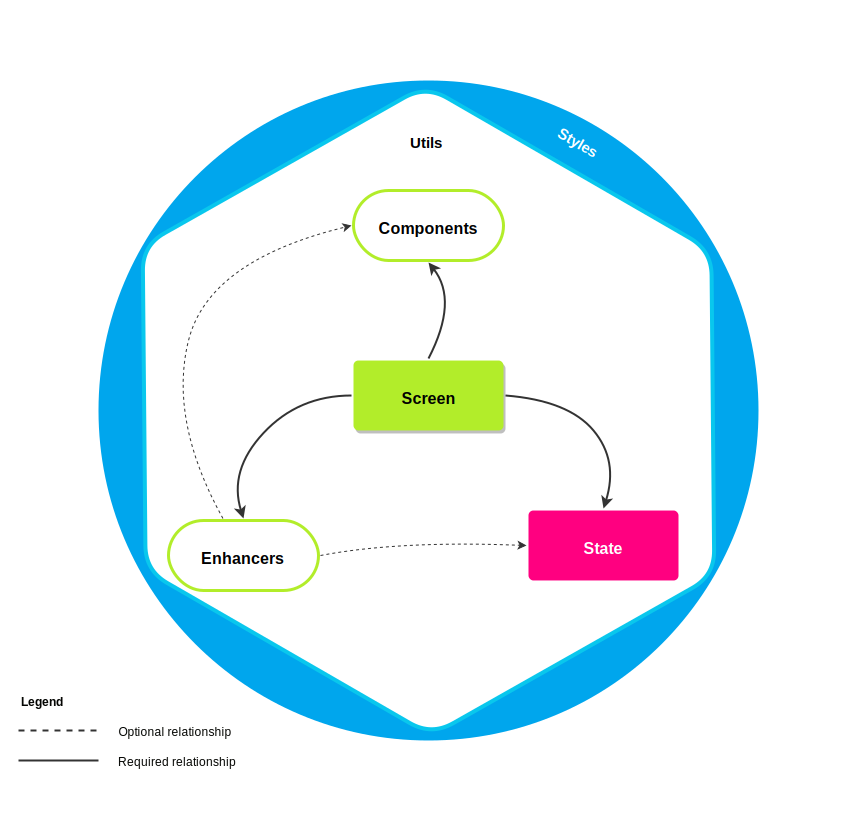
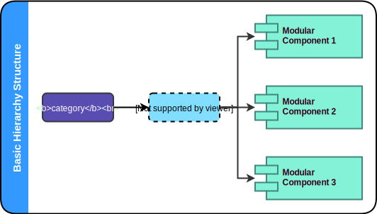
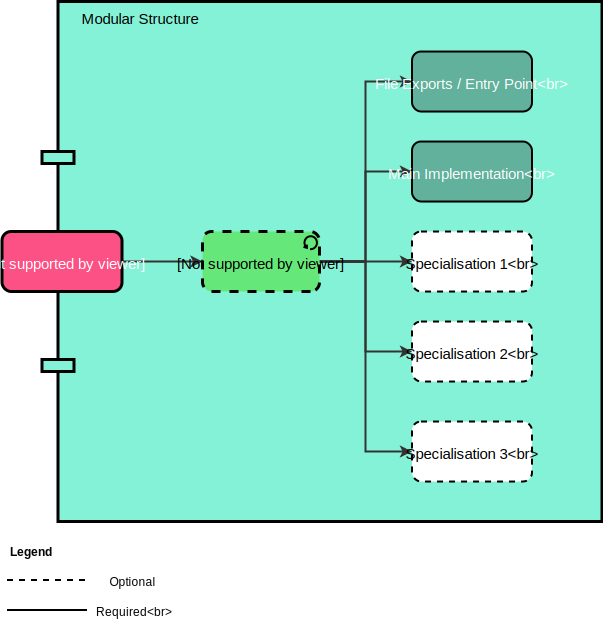
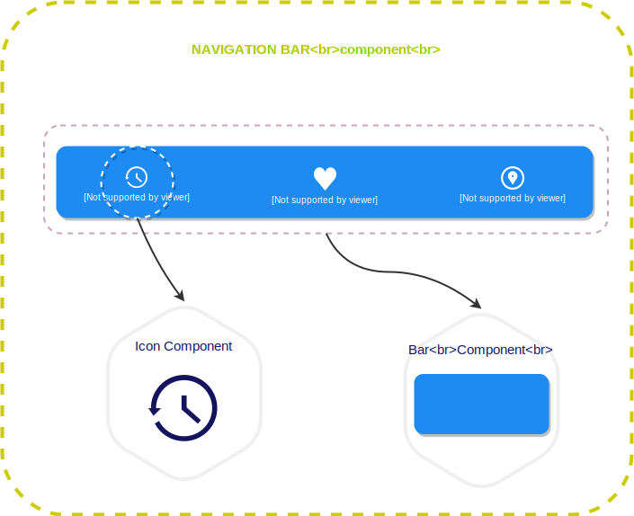
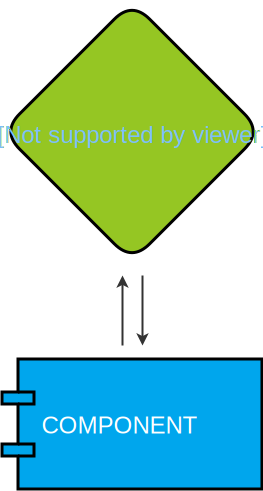

# [React] Adventure Design Proposal

> A **high-ending modular architecture** with **screen centric development** for building spa applications with clean separation of concerns, high cohesion and maintainability. 
>
> **Grow big, keep smart**.

## Table of Contents

- [[React] Adventure Design Proposal](#react-adventure-design-proposal)
  - [Table of Contents](#table-of-contents)
  - [Introduction](#introduction)
  - [Why Adventure as a proposal name?](#why-adventure-as-a-proposal-name)
  - [Goal](#goal)
  - [Naming Convention](#naming-convention)
    - [Extensions](#extensions)
    - [File name](#file-name)
    - [Optional file name prefix](#optional-file-name-prefix)
    - [Component Naming](#component-naming)
    - [Reference Naming](#reference-naming)
    - [Overview](#overview)
  - [Elements](#elements)
    - [Components](#components)
    - [Enhancers](#enhancers)
    - [Screen](#screen)
      - [Layout](#layout)
      - [Shared](#shared)
    - [State](#state)
    - [Styles](#styles)
    - [Utils](#utils)
  - [Interactions](#interactions)
    - [Overview](#overview)
  - [The Modular Approach](#the-modular-approach)
    - [Basic Hierarchy Principle](#basic-hierarchy-principle)
      - [Example](#example)
      - [Overview](#overview)
    - [Modular Structure: Designing Modules](#modular-structure-designing-modules)
      - [Example](#example)
  - [UI Component: Development Principle](#ui-component-development-principle)
    - [The right level of abstraction](#the-right-level-of-abstraction)
      - [Example](#example)
    - [The development process](#the-development-process)
      - [Development flow diagram](#development-flow-diagram)
  - [Advantages & Disadvantages](#advantages-disadvantages)
    - [Advantages](#advantages)
    - [Disadvantages](#disadvantages)
  - [Resources](#resources)
    - [Documentation Generators](#documentation-generators)
    - [Live Style Guide](#live-style-guide)
    - [JavaScript Style Guide](#javascript-style-guide)
    - [Learn](#learn)
    - [Articles](#articles)
  - [License](#license)
  - [Amendments](#amendments)

  <br />

## Introduction

  **React.js** introduced a new way to create _modern web applications_ by giving the developers power to code in a very concise and declarative way, besides its short learning curve.

  Due to its popularity over the years, you can find with easy many articles about [code pattern](https://www.google.com/search?q=react+code+pattern+&oq=react+code+pattern) and even greats [JSX Style Guide](https://github.com/airbnb/javascript/tree/master/react) to follow, **and it's great!**

  But when it comes to _project design_, **there's a real struggle to find or create one that provides scalability and enforces a development contract between developers**, after all, whenever a new developer joins the team, another structure pattern might happen and will happen if he/she  does not understand its project structure.

  And the result of that? A real mess over time.

  For this reason we created the `Adventure Design Proposal` in order to provide a **understandable, workable, maintainable and scalable environment over time**.

  <br />

  **[⬆ back to top](#table-of-contents)**

  <br />

## Why Adventure as a proposal name?

  Because the whole journey until this point have been an adventure and we would like to the adopter have the same adventure, focusing more on coding quality and less on stressing matters.

  <br />

  **[⬆ back to top](#table-of-contents)**

  <br />

## Goal

  In addition to the points mentioned in the [introduction](#introduction), we, as Engineers, we're constantly looking for new ways to *improve* our code base **with the minimum refactor effort**, after all, something might break.

  By all those reason, we came up with this approach, which give us the ability to:

  - Establish a `development contract` between developers.
  - Ensure `application scalability`.
  - Provide a `readable` and `searchable` structure.
  - Make every `component, function or screen self-evident`.
  - `Implement new tools` and `safely delete` legacy/unused with the **minimum effort** and **greater confidence**.
  - To `easily create or update` different part of the application in the shortest possible time.


  Paraphrasing Steve Krug:

  > _"Making every component, function or screen self-evident is like having good lighting in a store: **it just makes everything seem better**."_


  <br />

  **[⬆ back to top](#table-of-contents)**

  <br />

## Naming Convention

### Extensions

  Use `.jsx` for React components, otherwise use `.js`.

<br />

### File name
  All file name should be written in `Lower Camel Case`.
  E.g. `profile.jsx`, `modalHeader.jsx`.

<br />

### Optional file name prefix

  In some cases when you follow the [`Modular Structure`](#modular-structure-designing-modules) and end up with **just a few files** inside the _subdomain directory_, you can choose to use a file prefix instead of placing then inside a subdomain folder. This **might increase your structure readability and file search capability**.

  For that, you should follow the following pattern: `[subdomain].[fileName].[ext]`

  Example:
    
  ```js
  // let's assume you have the file tree shown below.
  // you can turn this tree
  configurations
  ├── webpack
  │   ├── configuration // this is the Modular Structure 'subdomain'
  │   │   ├── development.js
  │   │   ├── production.js
  │   │   └── tests.js


  // into this simpler and more readable one
  configurations
  ├── webpack
  │   ├── configuration.development.js
  │   ├── configuration.production.js
  │   └── configuration.tests.js
  ```

  > Note: `subdomain` can also be read as `group, association, common denomination`.

<br />

### Component Naming

  All React Component name declaration should be written in `Upper Pascal Case` and should be **named after its modular structure path**: `Domain + Subdomain`. 

  > See [Modular Structure](#modular-structure-designing-modules) for more info.
  
  Example:
  
  ```jsx
  // bad - Has Domain naming BUT in lower case
  // --------------------------------------------
  // | Directory path: button/index.jsx         |
  // | Component name: button                   |
  // --------------------------------------------
  class button extends Component { ... }
  const button = props => ...

  // also bad - Domain naming + unnecessary extra name
  // --------------------------------------------
  // | Directory path: button/index.jsx         | 
  // | Component name: buttonComponent          |
  // --------------------------------------------
  class buttonComponent extends Component { ... }
  const buttonComponent = props => ...


  // good - Domain naming
  // --------------------------------------------
  // | Directory path: button/index.jsx         |
  // | Component name: Button                   |
  // --------------------------------------------
  class Button extends Component { ... }
  const Button = props => ...

  // also good - Domain + Subdomain naming
  // --------------------------------------------
  // | Directory path:  modal/header/index.jsx  |
  // | Component name:  ModalHeader             |
  // --------------------------------------------
  class ModalHeader extends Component { ... }
  const ModalHeader = props => ...
  ```

<br />
  
### Reference Naming

  Use the *`Component Name`* as referencing name. It should follow the same guiding principles.

  ```jsx
  // bad 
  import Modal from './modal/index';
  import Header from './modal/header';
  import Body from './modal/body';
  import Footer from './modal/footer';

  // good
  import Modal from './modal';
  import ModalHeader from './modal/header';
  import ModalBody from './modal/body';
  import ModalFooter from './modal/footer';
  ```
  > **Note**: As [Airbnb React Style Guide](https://github.com/airbnb/javascript/tree/master/react#naming), we don't declare `index` file as part of the import statement.


  <br />

  **[⬆ back to top](#table-of-contents)**

  <br />
  

### Overview

  


  <br />

  **[⬆ back to top](#table-of-contents)**

  <br />

## Elements

  The `design proposal` is composed by **6 basic `elements`**: `components`, `enhancers`, `screen`, `state`, `styles` and `utils`.

  
### Components

  The _`Components`_ represents small units of the UI (User Interface) and are presentational; it should  be **open for extension** and have only **one reason (responsibility) to exists**. You can also define *reason or responsibility* as a *reason for change*.

  It **`should be an autonomous part of your application`**.

  > **Component example**: Button, Avatar, List.

  Connects with: others [Components](#components).

  <br />

### Enhancers

  _`Enhancers`_ are functions that receives  class/function/method/property and **return given element intensified/improved**.

  > **Enhancers example**: Hight Order Components and Decorators.

  Connects with: [Components](#screen) and [State](#state).

  <br />

### Screen

  _`Screen`_ is the **central part of your application**, it is responsible to `compose` the page with _Components_, `consume data` from State and handle all the user actions.

  It's the `component target` of your routing system.

  > **Screen example**: Home, Contact, About Us.

  Connects with: [Components](#components), [Enhancers](#enhancers) and [State](#state).

#### Layout

  _`Screens`_ frequently shares the same visual structure: _header_, _sidebar_ and _footer_ for example.

  For that reason the _`Layout Screen`_ is used to centralized those commons UI (User Interface) and its logic into a **single and reusable screen**.

  _`Layout`_, although is an optional _`Screen`_, **we strongly recommend you to have it**. It might **shorten the [`reconciliation`](https://reactjs.org/docs/reconciliation.html) process time**  when working with a routing system, due to the logical abstraction adopted.


  > **Layout example**:
  

  > **Note**: In case you have a multiple layouts system, the [Modular Structure](#modular-structure-designing-modules) allows you to have a nice and concise structure by using the `subdomain` directory. 
  > 
  > E.g. `Screens/Layouts/Errors`, `Screens/Layouts/Account`, `Screens/Layouts/Default`, so on.

  Connects with: [Components](#components), [Enhancers](#enhancers), [State](#state) and [Screen](#screen).

  <br />

#### Shared
  
  It is common to find _designs specifications_ that shares the same visual structure (UI) and logic across others `Screens`,
  such as _breadcrumbs_, _image sliders_ and _product cards_.
  
  For that reason the _`Shared`_ folder is used to centralized those commons UI (User Interface) and its logic into a
  **single and shareable endpoint**, avoiding then, unnecessary logic and interface duplications.

  Connects with: [Components](#components), [Enhancers](#enhancers), [State](#state) and [Screen](#screen).

  <br />

### State

  The _`State`_ refers to the *Data State*, and is responsible to contain and manage the **data flow core** of your application; this is the right place to put your Business Logic.

  > **State example**: [Redux](https://redux.js.org/), [Mobx](https://mobx.js.org/), [Flux](https://facebook.github.io/flux/), Middleware and so on.
  *Tip: [re-ducks proposal](https://github.com/alexnm/re-ducks) - a modular redux approach*.

  Connects with: no one.

  <br />

### Styles

  _`Styles`_ as the name indicates, is the place you should put all the **global styles** of your application. If your style is custom case, you should take a look in the [Modular Approach](#the-modular-approach) section.

  > **Styles exaple**: .css, .scss, .sass, .less

  Connects with: Global application.

  <br />

### Utils

  _`Utils`_ is the place where you should place your **global code snippets**. If your code snippet is not meant to be global, you should take a look in the [Modular Approach](#the-modular-approach) section.

  Connects with: Global application, except [Styles](#styles).

  <br />

  **[⬆ back to top](#table-of-contents)**

  <br />

## Interactions

  - **The Components** are responsible to the UI (User Interface) of your application. It receives inputs directly from the Screen or from the Enhancers. 
  - **The Screen** is the presentation of a component composition and is interconnected with the State; it is responsible to consume the State and to handle the user actions.
  - **The State** is accountable for the application's data flow core. It performs data manipulation according to your business logic, providing normalized data and handling actions for the Screen or for the Enhancers.
  - **The Enhancers**, in its turn,  represents a improvement of a given Screen, intensifying its logic. It also can be composed of Components and/or be consumer of the State.
  - **The Styles** is responsible to manage the global styles of your application.
  - **The Utils**, as well as the Styles, is responsible for the global code snippets.

  <br />

  **[⬆ back to top](#table-of-contents)**

  <br />

### Overview

  The following diagram represent the interaction flow between the elements.

  


  <br />

  **[⬆ back to top](#table-of-contents)**

  <br />


## The Modular Approach

  The Modular Approach is a software design technique that emphasizes separating the functionality of a software into **independent and interchangeable modules**, such that each **contains everything necessary to execute only one aspect of the desired functionality**.

  The Modularity can be summarized into three guiding principles:

  - **Strong encapsulation:** implementation details are hidden inside components, leading to low coupling between different parts. Teams can work in isolation on decoupled parts of the system.
  - **Well-defined interfaces:** A component can be replaced by any implementation that conforms to the interface specification.
  - **Explicit dependencies:** having a modular system means distinct components must work together.

  <br />

  **[⬆ back to top](#table-of-contents)**

  <br />

### Basic Hierarchy Principle

  Working with medium/large applications usually implies working into a dynamic environment, which require **smart** and **fast** solutions for even the simplest changes, like when there's a change in the _brand design guide_.

  Sometimes those changes **can break your application** and require an **extra** and even maybe **unforeseen effort of your team** to fix it, which might not be good for your business, especially working with _Agile Environment_.

  By this reason, we adopted an optional **`versioning`** directory as part of the _basic hierarchy_. This very simple solution provides the power to create a breaking content without harm the application.

  In that case, let's assume the following simple scenario:

  > A certain company updated its design guide, which requires to update the jumbotron component to keep it up to date. Before there was a rounded neutral typography, now switched to a square and colorful one.
  >
  > **The problem is:** this update will affect every component that this jumbotron was implemented, since the change was visually significant, it will make the content around it look odd.
  Because of that, it will require a complete update/refactor of the places it was implemented, until it be able to go to production.
  >
  > **The solution:** by simply implementing a `versioning` directory, we can place all new contents inside this directory. This will give us the power to migrate gradually the `screens` into the new style guide, and at the same time, those `screens` can be deployed to production.

  Also this is a good fit for `A/B tests`:

  > A certain company wants to test which feature leads to a better CvR (Conversion Ratio).
  >
  > **The problem is:** creating a new component and append a number in its name **is not a good idea**. E.g. `<ProductGallery2 />`.
  >
  > This simply is meaningless, by which **we do not understand its reason for existence by simply looking at it**.
  >
  > **The solution:** implementing a `versioning` directory and naming it after its desired reason to exist. E.g. `abTestBlackFriday`, `abTestSummerSales`, so on.
  >
  > This will give us a concise structure and easily understandable. A further clean-up/refactor would be a nice and smooth task to perform.
  
  <br />

  **Summarizing**

  The *Basic Hierarchy Principle* can be defined by the following maximum:

  > **Divide and conquer** 
  <small>From latim: *divide et impera*</small>

  <br />

  **[⬆ back to top](#table-of-contents)**

  <br />

#### Example

  - With `versioning` directory:

  ```jsx
  components                  // category
  ├── v1                      // versioning
  │   ├── [modular component]
  │   ├── [modular component]
  │   ├── [modular component]
  │   ├── [modular component]
  ```

  ```jsx
  components                  // category
  ├── abTestBlackFriday       // versioning
  │   ├── [modular component]
  │   ├── [modular component]
  │   ├── [modular component]
  │   ├── [modular component]
  ```

  - Without `versioning` directory:

  ```jsx
  screen                    // category
  ├── [modular component]
  ├── [modular component]
  ├── [modular component]
  ├── [modular component]
  ├── [modular component]
  ```
  > **Note**:
  We don't consider that the Screen need versioning due to the independency given by the Modular Structure and also for its single use case, which makes an upgrade much easier.
  > 
  > However, you should apply what fits better for your system requirements.

  <br />

  **[⬆ back to top](#table-of-contents)**

  <br />


#### Overview

  

  <br />

  **[⬆ back to top](#table-of-contents)**

  <br />

### Modular Structure: Designing Modules

  The `module structure` is the most crucial part of the `design proposal`, it will define how our application will be structured and its behavior from the day one.
  
  The following diagram represents the basic structure of a modular structure.

  

  > **Note**: the `subdomain` directory listed above can be implemented as many times as necessary. Although in some cases it might be a better approach to use the [Optional file name prefix](#optional-file-name-prefix) instead.
  > 
  > See also: [Optional file name prefix](#optional-file-name-prefix)

  <br />

  **[⬆ back to top](#table-of-contents)**

  <br />

#### Example

  - Without `subdomain` directory:

  ```jsx
  header             // domain
  ├── index.js       // file exports / entry point
  ├── header.jsx     // main implementation
  ├── query.graphql  // specialization
  ├── routes.js      // specialization
  └── styles.js      // specialization
  ```

  - With `subdomain` directory:

  ```jsx
  modal                 // domain
  ├── header            // subdomain
  │   ├── index.js      // file exports / entry point
  │   ├── header.jsx    // main implementation
  │   └── styles.js     // specialization
  │
  ├── body              // subdomain
  │   ├── index.js      // file exports / entry point
  │   ├── body.jsx      // main implementation
  │   └── styles.js     // specialization
  │
  ├── footer            // subdomain
  │   ├── index.js      // file exports / entry point
  │   ├── footer.jsx    // main implementation
  │   └── styles.js     // specialization
  ├── index.js          // file exports / entry point
  ```

  - With `subdomain` suppressed:

  ```jsx
  dropdown              // domain
  ├── index.js          // file exports / entry point
  ├── dropdown.jsx      // main implementation
  ├── divider.jsx       // main implementation of the suppressed subdomain
  ├── divider.styles.js // specialization of the suppressed subdomain
  └── styles.js         // specialization
  ```

  <br />

  **[⬆ back to top](#table-of-contents)**

  <br />

## UI Component: Development Principle

  During the development process, we want to make sure that we achieve the **maximum level of component universality**, that is, to ensure that it can be inserted into **`any type of context`** and requires no further implementation to execute its job.

  To accomplish this, we need to have the **right level of abstraction** and **zero dependencies**.


### The right level of abstraction

  **Abstraction is a useful and powerful** tool to solve any kind of problems, since it allows you to `mentally isolate an element or property of a whole, to consider it individually`.

  In that way, we are able to work with a simpler solutions, easier to work with and achieve the maximum level of reusability.

  In other words, a right level of abstractions will allow you to **`separate what is important within a given context. Simplify`**.

  > See [Abstraction Principle](https://en.wikipedia.org/wiki/Abstraction_principle_(computer_programming))

  <br />

  **[⬆ back to top](#table-of-contents)**

  <br />

#### Example

  Let's assume you just received a new task to create the the `navigation bar` from the following UI design:


  > <small>Navigation Bar UI Design</small>
  >
  > 

  <br />

  After having a good looking at the UI design and understanding its criteria, *you feel confident to accomplish this task*.

  So, most of the develops would create the `navigation bar` as a **single component**, developing it based into 2 main structures:

  > 1. A **main wrapper**, acting as the main container structure;
  > 2. A **navigation item** to be iterated over, containing:
      2.1. An icon image;
      2.2. A label;
      2.3. And a target url.

  Although this approach is **not wrong** and achieve the expected result, it is possible to have a **`better component reusability approach`**, which makes your development process ***faster*** and your production code ***smaller*** in the medium/long term, thus achieving, **the same initial performance**.

  That said, applying the `right level of abstraction` in this navigation bar, we would realize that we could split it into **2 small reusable components**:

  1. An `icon component` and;
  2. A `bar component`.

  Each of those component will compose the `navigation bar` main structure and still give us *`n`* implementation possibility.

  So we would end-up having the following composition structure:
  
  
  
  <br />

  Realize that the application of the `right level of abstraction`, besides providing you the benefits mentioned above,  is also a great way to enforce the `separation of concerns` during the development process.

  <br />

  **[⬆ back to top](#table-of-contents)**

  <br />

### The development process

  The component development process is quite straightforward and very pleasant, for that, we use a [**Style Guide Service**](#live-style-guide) in order to **ensure zero level of dependency**.
  
  Besides the intrinsic benefits of a Style Guide Service, such as having a component playground and documentation, it also provides a **brand new development environment to work with, `away from all dependencies` of your application**.

  Due to that lean environment, develop a component with no dependencies is quite simple and easy, such way that if you by mistake or even intentionally add a dependency, the Style Guide Service will give throw an error and the component simply will not render.

  That said, all you need to do is:

  1. **Install** and configure a [Style Guide Service](#live-style-guide).
  2. **Create** your component and the required connection;
  3. **Code** it;
  3. **Check it out** in the Style Guide Service.
  4. **Return** to the step 3 until its done.

  Simple, straightforward and good for business.

  <br />

  **[⬆ back to top](#table-of-contents)**

  <br />

#### Development flow diagram

  

  > See *[Live Style Guide](#live-style-guide) reference*.

  <br />

  **[⬆ back to top](#table-of-contents)**

  <br />

## Advantages & Disadvantages


### Advantages

  - **Simultaneous development**: Allow multiple developers to work simultaneously in the [Elements](#elements).
  - **High cohesion**: Adventure Design Proposal allow logical grouping of the related structure.
  - **Low coupling**: The [Modular Structure](#modular-structure-designing-modules) component's can be replaced with alternative implementations that provide the same services.
  - **Easy modification**: Due to de separation of concerns, create, update or delete code/files can be done with the minimum effort and greater confidence.
  - **Maximum Universality for the Components**: The [UI Component Development Principle](#ui-component-development-principle) provides a road-map to ensure that we achieve the maximum level of reusability in any type of context with zero dependencies.


  <br />

  **[⬆ back to top](#table-of-contents)**

### Disadvantages

  - **Code Navigability**: The navigation can be complex in view of it introduces new layers of abstraction and requires users to adapt to the decomposition criteria of [[React] Adventure Design Proposal](#react-adventure-design-proposal).
  - **Pronounced learning curve**: Knowledge on multiple technologies becomes the norm. Developers using [[React] Adventure Design Proposal](#react-adventure-design-proposal) need to be skilled in multiple technologies.
  - **Over complexity for simple use case**: Usually the simple use cases has a lack of complexity, by which adopting the [[React] Adventure Design Proposal](#react-adventure-design-proposal) would not bring the benefits listed above, but otherwise, increase its complexity and development time with no need. 
  - **High level of registration**: The down side of the [Modular Structure](#modular-structure-designing-modules) is the high level of registration required to connect the modules into a whole. Without a proper organization, it can decrease the code readability.

  <br />

  **[⬆ back to top](#table-of-contents)**

  <br />


## Resources

### Documentation Generators

  - [GitBook](https://github.com/GitbookIO/gitbook).
  - [JSDoc](http://usejsdoc.org/).
  - [Read the Docs](https://github.com/rtfd/readthedocs.org).
  - [Bookdown](https://bookdown.org/).
  - [MkDocs](https://github.com/mkdocs/mkdocs/)
  - [Sphinx](http://sphinx-doc.org/).
  - [Slate](https://github.com/tripit/slate).
  - [Pandoc](http://pandoc.org/).
  - [Documentation theme for Jekyll](http://idratherbewriting.com/documentation-theme-jekyll/).
  - [ApiDoc](https://github.com/apidoc/apidoc).
  - [SassDoc](http://sassdoc.com/).
  - [documentation.js](https://github.com/documentationjs/documentation).

### Live Style Guide

  - [React Styleguidist](https://github.com/styleguidist/react-styleguidist)
  - [Storybook](https://github.com/storybooks/storybook)
  - [docz](https://www.docz.site/)

### JavaScript Style Guide

  - [Airbnb JavaScript Style Guide](https://github.com/airbnb/javascript)
  - [Google JavaScript Style Guide](https://google.github.io/styleguide/javascriptguide.xml)
  - [Airbnb React Style Guide](https://github.com/airbnb/javascript/tree/master/react)

### Learn

  - [Comprehensive Overview of ES6 Features](http://es6-features.org)
  - [JavaScript Patterns](https://www.amazon.com/JavaScript-Patterns-Stoyan-Stefanov/dp/0596806752)
  - [High Performance Web Sites: Essential Knowledge for Front-End Engineers](https://www.amazon.com/High-Performance-Web-Sites-Essential/dp/0596529309)
  - [Thinking in React](https://reactjs.org/docs/thinking-in-react.html)
  - [Ducks Modular Approach Proposal](https://github.com/alexnm/re-ducks)

### Articles

  - [Modular programming overview](https://en.wikipedia.org/wiki/Modular_programming)
  - [Modules vs. microservices](https://www.oreilly.com/ideas/modules-vs-microservices)
  - [On Modular Architectures](https://medium.com/on-software-architecture/on-modular-architectures-53ec61f88ff4)
  - [Becoming an accidental architect](https://www.oreilly.com/ideas/becoming-an-accidental-architect)
  - [Abstraction Principle](https://en.wikipedia.org/wiki/Abstraction_principle_(computer_programming))
  - [The Abstraction Principle](http://www.cs.sjsu.edu/faculty/pearce/modules/lectures/ood/principles/Abstraction.htm)


## License

  MIT License

  Copyright (c) 2018 Marcos Gonçalves

  Permission is hereby granted, free of charge, to any person obtaining a copy
  of this software and associated documentation files (the "Software"), to deal
  in the Software without restriction, including without limitation the rights
  to use, copy, modify, merge, publish, distribute, sublicense, and/or sell
  copies of the Software, and to permit persons to whom the Software is
  furnished to do so, subject to the following conditions:

  The above copyright notice and this permission notice shall be included in all
  copies or substantial portions of the Software.

  THE SOFTWARE IS PROVIDED "AS IS", WITHOUT WARRANTY OF ANY KIND, EXPRESS OR
  IMPLIED, INCLUDING BUT NOT LIMITED TO THE WARRANTIES OF MERCHANTABILITY,
  FITNESS FOR A PARTICULAR PURPOSE AND NONINFRINGEMENT. IN NO EVENT SHALL THE
  AUTHORS OR COPYRIGHT HOLDERS BE LIABLE FOR ANY CLAIM, DAMAGES OR OTHER
  LIABILITY, WHETHER IN AN ACTION OF CONTRACT, TORT OR OTHERWISE, ARISING FROM,
  OUT OF OR IN CONNECTION WITH THE SOFTWARE OR THE USE OR OTHER DEALINGS IN THE
  SOFTWARE.


## Amendments

  We encourage you to fork this design pattern and update the proposal to fit your application requirements.
